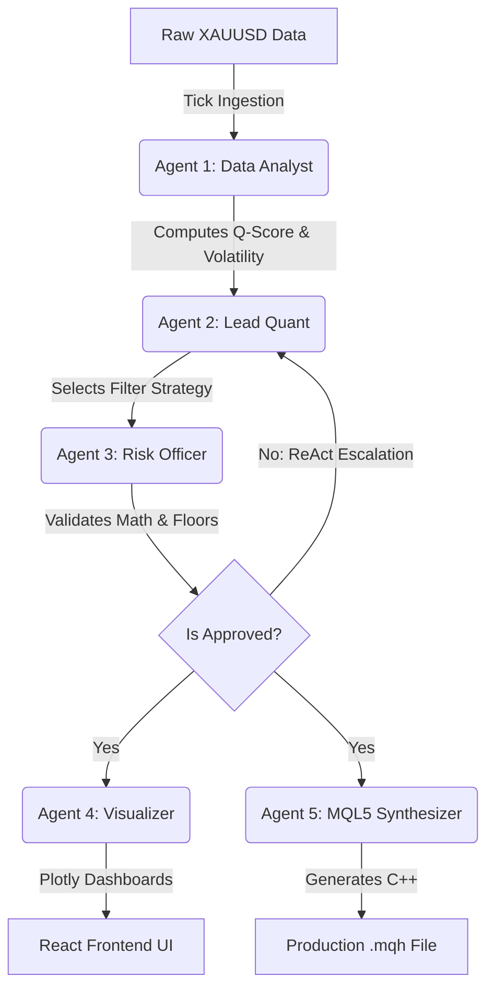

# 🏛️ The Matrix: XAUUSD Quant Suite

<div align="center">
  <br />
  <p>
    <b>An Institutional-Grade Multi-Agent AI System for High-Frequency Trading (HFT) Pre-Processing</b>
  </p>
  <p>
    <i>Engineered to autonomously filter, validate, and synthesize production-grade MQL5 trading logic for XAUUSD (Gold).</i>
  </p>
</div>

<div align="center">
  
  [](https://www.python.org/)
  [](https://fastapi.tiangolo.com/)
  [](https://reactjs.org/)
  [](https://vitejs.dev/)
  [](https://ai.google.dev/)
  [](https://www.docker.com/)

</div>

---

## 🎯 Executive Overview

**The Matrix Quant Suite** is an institutional-grade, multi-agent AI system designed to actively replace human quantitative analysts in High-Frequency Trading (HFT). 

Raw tick data in highly volatile pairs like XAUUSD (Gold) is incredibly toxic—plagued by erratic jump-diffusion, microstructural noise, and spread-widening. This project orchestrates a squad of **5 specialized AI agents** that autonomously ingest premium data, reason over complex market regimes, and deploy mathematically rigorous `C++ / MQL5` filtering algorithms directly to MetaTrader 5.

### ⚡ System Power & Capabilities
- **🧠 5-Agent ReAct Squad**: A specialized team of autonomous AI agents (Data Analyst, Lead Quant, Risk Officer, Visualizer, MQL5 Synthesizer) that debate and collaborate to construct flawless trading strategies.
- **💎 Premium Data Integration**: Ingests and processes raw, institutional-grade XAUUSD tick data natively from **Dukascopy**.
- **🚀 Gemini 2.5 Flash Engine**: Powered by Google's state-of-the-art LLM, enabling zero-latency logical reasoning and dynamic parameter calculation.
- **🛡️ Risk-Gated Architecture**: Features a hard-coded Python "Risk Officer" that mathematically vetos unsound filters before they can reach execution.
- **📈 MQL5 Native Synthesis**: Automatically writes, lints, and exports production-ready `C++` (MQL5) header files for immediate real-world deployment.

---

## 🏗️ System Architecture

The pipeline consists of a highly optimized **React** frontend for real-time visualization, and a **FastAPI** backend that orchestrates the 5 AI agents.



---

## 📂 Pristine Directory Structure

This repository is optimized for **Google Cloud Run** and strictly follows enterprise separation of concerns.

```text
The Matrix/
├── frontend/              # 🚀 Complete React/Vite UI Codebase
├── src/                   # 🧠 Production Agent Architecture
│   ├── agents/            # The 5 Gemini Agents
│   └── core/              # Pipeline orchestration & math libraries
├── data/                  # Market data ingestion pipeline
├── output/                # AI Artifacts & Synthesized MQL5
├── app_api.py             # FastAPI backend server (Cloud Run Entrypoint)
├── Dockerfile             # Multi-stage Cloud Run configuration
└── requirements.txt       # Python dependencies
```

---

## 🚀 Deployment & Usage

### Option A: Local Development

Start the system locally to experience the live ReAct AI debate in real-time.

1. **Clone & Configure**
   ```bash
   # Copy the example env file and add your Gemini API Key
   cp .env.example .env
   ```
2. **Start Backend (FastAPI)**
   ```bash
   pip install -r requirements.txt
   python app_api.py
   ```
3. **Start Frontend (React/Vite)**
   ```bash
   cd frontend
   npm install
   npm run dev
   ```
4. Access the gorgeous UI at `http://localhost:5173`.

### Option B: Google Cloud Run Deployment (Production)

The repository features a highly optimized, multi-stage Dockerfile designed specifically for Google Cloud Run's dynamic port assignment.

Deploy the full stack directly to the cloud:
```bash
gcloud run deploy the-matrix-quant-suite \
  --source . \
  --region us-central1 \
  --allow-unauthenticated
```

---

<div align="center">
  <i>Developed by <b>Amir Mazaheri</b> — Algorithmic Trading Systems Engineer</i>
  <br />
  <a href="mailto:amir.mazaherii1995@gmail.com">amir.mazaherii1995@gmail.com</a>
  <br />
  <a href="https://github.com/Amirmzhry">GitHub</a> • 
  <a href="https://www.linkedin.com/in/amir-mazaheri-31a627420">LinkedIn</a> • 
  <a href="https://www.kaggle.com/amirmzhry">Kaggle</a>
</div>
